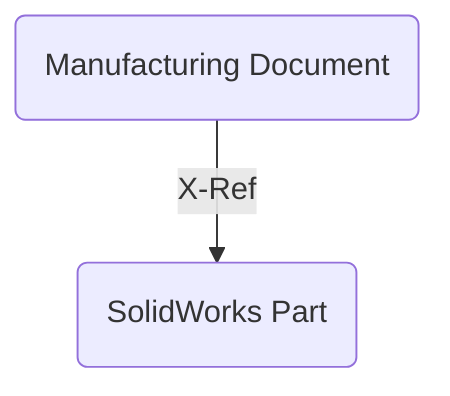
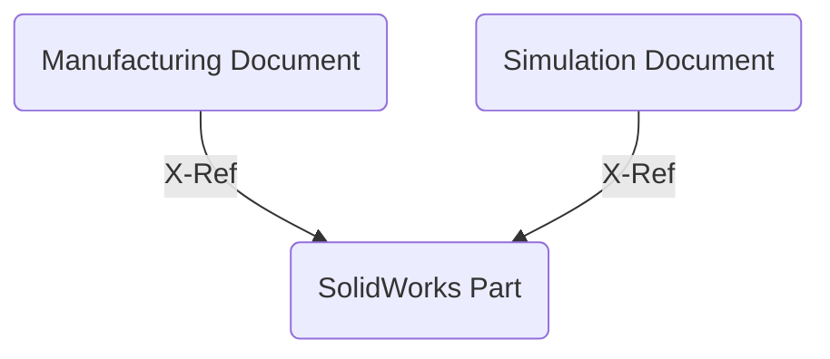
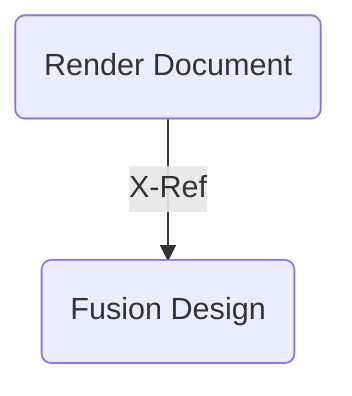
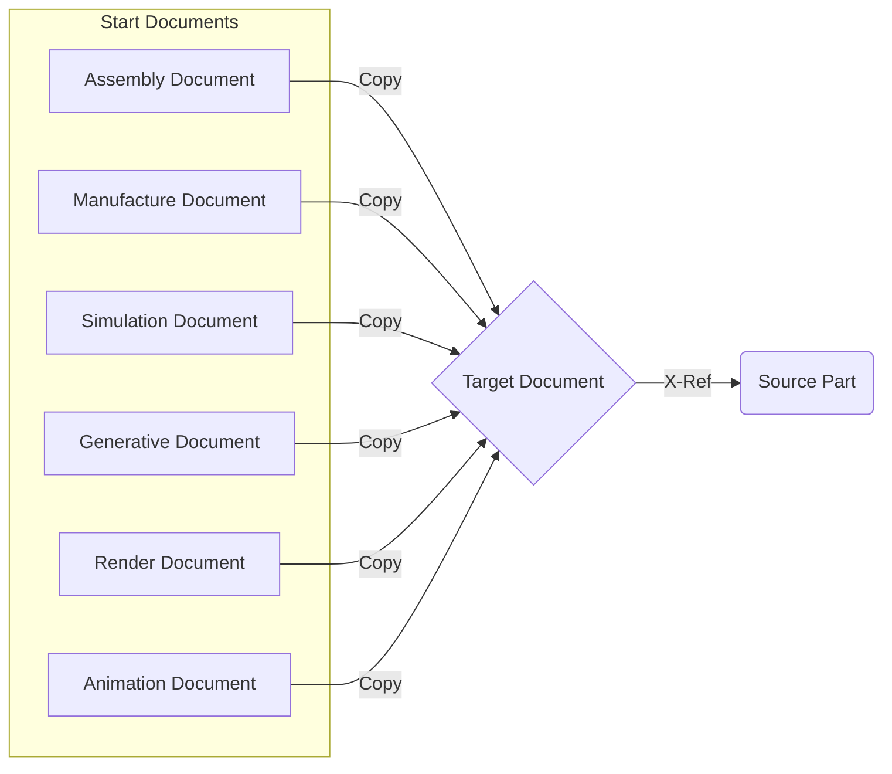

# Create Discipline Document

When working with imported AnyCAD data, in a team, or on multiple manufacturing processes, it is useful to insert an existing source document into a new related document so that work can be done in the new related document and not change or lock the source document. This add-in creates a Design Workspace command that produces a new related document from a pre-configured list of saved start document that reference the source document. The source document must be the active document and must be saved before this add-in's command can be used.

When creating the new related document you may select from a configurable list of workflows. Each workflow allows a pre-saved start document to be used to create the new related document. It also pre-populates the name of the new related document to capture workflow and the mae of the source document. This makes finding and understand why the new related document was created easier.

Here are a few examples for how you might use this add-in:

### AnyCAD

You have an existing SolidWorks document that you upload using Fusion 360 Team to you hub.
You can open this SolidWorks part in Fusion 360 Desktop client and then use this add-in to create a new referencing document for manufacturing and CNC programming.



Later you may need to run FEA simulations on the same SolidWorks design.
Using the add-in you can create a new related document referencing the SolidWorks AnyCAD part.



Two related documents have been created. One for Manufacturing and one for Simulation.
Each document can have a unique user working on it an not block the others. This is very useful for teams to ensure you can have different discipline working on a design concurrently.

### Render designs with a common render setup

Using the start document's ability to pre store information. You open a new empty document and activate the rendering workspace.
You can define new emissive bodies as lights and store several different options for floors. In addition you setup the render defaults for exposure, HDRI Environment map, background, and camera focal settings. Defining these in the start part ensure that as you make future renderings you can have consistent look and feel to you renderings.



## Multiple Start Documents

To best use this add-in you should pre-create and save start documents that have information already defined in them. This allows you to automate and make smart start parts that can reduce setup for your intended workflows.
You can create a specific start document for each workflow and set the default naming scheme as you configure this add-in for your specific hub, team and use cases.

You can choose to save as much or as little information inside each start document.

**TIP:** It its always useful to save a generic empty start document and configure an plain assembly or default start document option so you can always get a simple new reference document when needed.

The Alpha release is pre-configured with 6 start parts. THESE HAVE URNs ALREADY DEFINED. THESE WILL NOT WORK IN YOUR HUB.
You must edit the the python document and configure your own start documents.

The 6 defined in the Alpha release are:

1. Assembly Document
2. Manufacture Document
3. Simulation Document
4. Generative Document
5. Render Document
6. Animation Document

When you select one of these, the start document is copied, saved and then your active source document is inserted. The new related document is then saved a second time automatically. This creates the needed versions to track the relationships between documents.

Comments are added to the versions for clarity.

### The basic relationships in a graph:



### User interface.

Once the Add-in is installed and running, you find the command in the Design Workspace -> Create Pannel at the bottom of the menu


You can add this command to your toolbar or "S Key" shortcuts.

To select from the different start document you choose from the drop down in the dialog displayed wgen cunning the "Create Related Document" command.


Thw drop down show available start documents.


The new related document is auto-named by default. You can uncheck the auto-name option and define a name of your own.
Click OK and the new related document is created and your source document is inserted.

## How to find your own documents URNs

Open the document you want to use as a start part.

From the application menu turn on the Text Command Pallet


Next, make sure you have "Py" turned on at the far right bottom of the text command pallet.


In the text command pallet type:

```
app=adsk.core.Application.get()
```

Next type:

```
id=app.activeDocument.dataFile.id
```

Now type:

```
id
```

Fusion will return the urn for the open active document. Select this string and copy it using the Right Mouse Click menu. Copy the entire string "urn:XXXXXX"


Open [Create-Discipline-Document.py](./Create-Discipline-Document.py)
Scroll down to line 31 and edit the myDocsDict with each of the documents you want.
Be sure to replicate the syntax, ensure you give each document a unique category like mfgDict, a unique Name like "Manufacturing"

You should remove all the existing example documents and only have entries for your own documents and urns as you extracted above. This modified document will work for all team members in the same hub so long as the are members of the project/folder where the start documents are stored.

**TIP:** If you save your start documents with the workspace you want to default to, this workspace will automatically default creating new related documents from these start documents.
